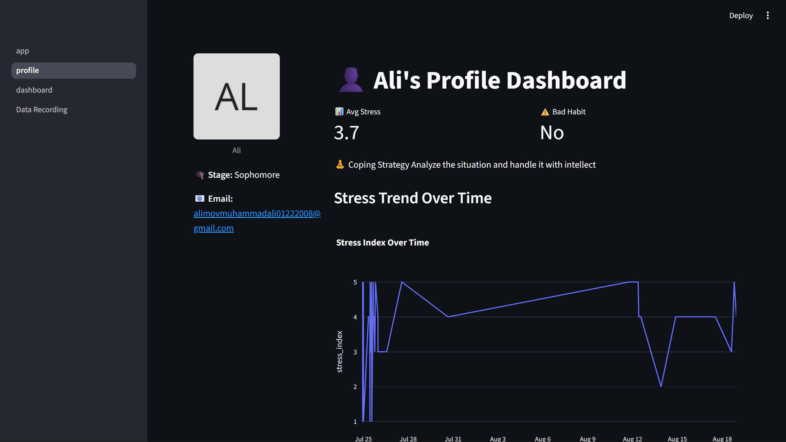
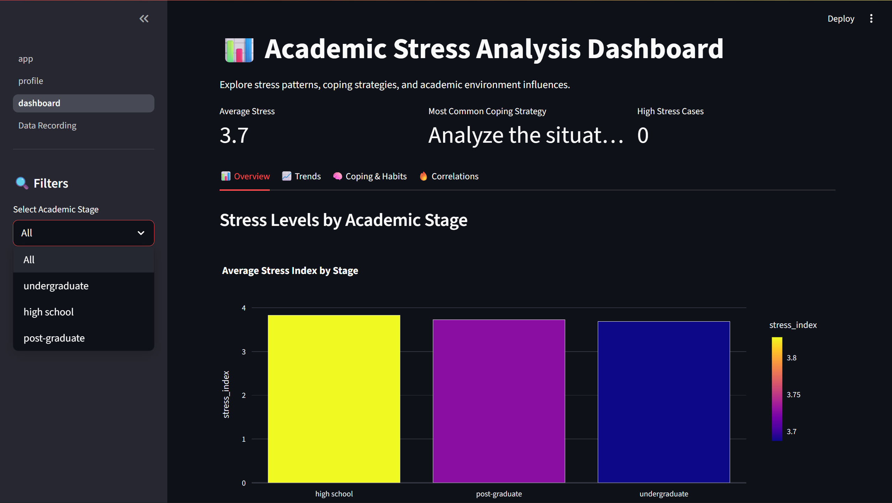
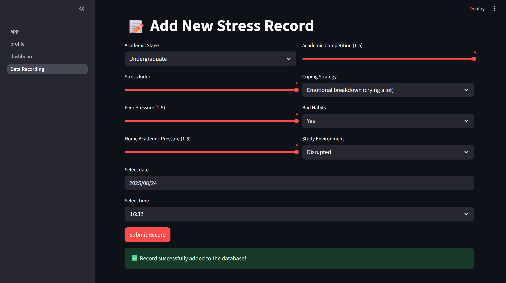
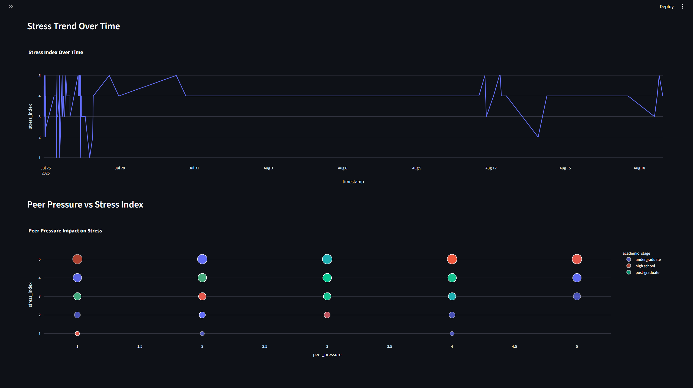

📊 Academic Stress Level Dashboard

An interactive web application built with Streamlit, PostgreSQL, and Plotly to analyze, visualize, and record academic stress data.

This project demonstrates skills in:

Python (ETL & Data Visualization)

SQL (Database design & queries)

Streamlit (Web App Framework)

Data Pipelines (ETL structure)

🚀 Features
🔹 Dashboard Page

Multiple data visualizations (line charts, bar plots, pie charts) using Plotly

Interactive filters by academic stage, coping strategies, and time period

Key metrics (KPIs) for average stress, most common habits, and coping strategy

Modern, clean, and responsive UI

🔹 Data Recording Page

User-friendly form to input new stress-level data

Validations for correct inputs

Data stored directly into PostgreSQL

🔹 Profile Page

Personalized student dashboard

Avatar, academic info, and email display

Stress trend visualization over time

Summary of coping strategies & habits

📂 STUDENT-STRESS-VISUALIZER/
│── 📄 app.py               # Main Streamlit entry point (multi-page setup)
│── 📂 pages/               # Streamlit multipage directory
│    │── 1_Dashboard.py     # Dashboard visualizations
│    │── 2_Data_Recording.py# Form for user data input
│    │── 3_Profile.py       # Profile summary page
│
│── 📂 sql/                 # SQL logic files
│    │── create_tables.sql
│    │── insert_data.sql
│    │── queries.sql
|    |── ...
│
│── 📂 data/
│    │── academic Stress level.csv # Initial dataset (imported into PostgreSQL)
│    
│    📂 config/
│    │── config.py # PostgreSQL database connection configuration python file
│        
│    📂 source/
│    │── query_runner.py # python module for running pre defined SQL queries
│        
│    📂 screenshots/
│    │── image ... png # screenshots from local hosted webpage of the app 
│
│── 📄 requirements.txt      # Python dependencies
│── 📄 README.md             # Project documentation
│── 📄 .streamlit/secrets.toml # Example DB credentials file
│── 📄 pyproject.toml        # Python dependencies
│── 📄 uv.lock  # UV generated python dependencies

🛠️ Tech Stack

Frontend/UI: Streamlit

Backend/Database: Local PostgreSQL database 

Visualization: Plotly

Python Libraries: Pandas, Psycopg2, Plotly, Streamlit

⚙️ Setup Instructions

1️⃣ Clone Repository

git clone https://github.com/Alimov2008/Student_stress_visualizer.git
cd stress-dashboard

2️⃣ Install Dependencies  

pip install -r requirements.txt

3️⃣ Configure PostgreSQL Connection

Create a database (e.g., stress_db) in PostgreSQL

Import the dataset (academic Stress level.csv) using create_tables.sql in queries folder

Store credentials in .streamlit/secrets.toml and inside .env 

DB_USER=user_name
DB_PASS=password
DB_HOST=localhost
DB_PORT=5432
DB_NAME=db_name

4️⃣ Run Locally

streamlit run app.py

5️⃣ Deploy Online

Push code to GitHub

Deploy via Streamlit Community Cloud

Use Supabase
 or Neon
 to host PostgreSQL

Add secrets in the Streamlit Cloud dashboard

📸 Screenshots

👨‍💻 Author

Developed by Ali Muhammad

🎓 Sophomore Software Engineer, IUT

📧 Contact: alimovmuhammadali01222008@gmail.com